# The Real Wives of Henry VIII
The Real Wives of Henry VIII is a site aimed to educate users about each of Henry VIII's wives. It will be targeted toward people who want to know more biographical details about the women themselves, not just as a part of Henry's story, and will also offer a place to share and read opinion pieces on the subject. There will also be an option to subscribe, so users can be notified of new content. Finally, it will also be somewhere they can find additional resources, should they want further information. The site should be responsive so that it can be easily viewed on desktop, tablet and mobile devices.

Final page: [https://mariacjones1.github.io/henry-viii-wives/](https://mariacjones1.github.io/henry-viii-wives/)

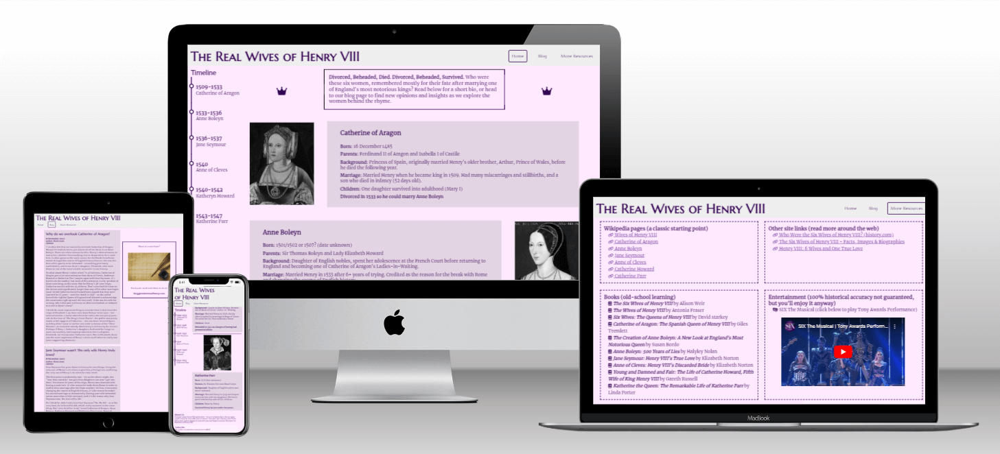

## User goals
- The primary user goal of the site is to find free information about Henry VIII's wives - who they were and what happened to them.
- Users will also be able to find and share opinions on the women, either on the overall subject or on specific topics which fall under the subject.
- Users will be able to find external resources, should they wish to have more information on Henry VIII's wives or on any of the individual women themselves.
- Users will be able to access and enjoy the site on any device.

## Owner goals
- The primary site owner goal is to provide a free educational resource to anyone who wants to learn more about Henry VIII's wives.
- The site should focus on the women, rather than Henry VIII. It should be made clear to the user that this is the case.
- The site should provide an opportunity and encourage users to subscribe to new content.

## Features

### Existing features
- Responsive layouts
    - Desktop-, tablet- and mobile-friendly designs (see mock-up above).
- Header and site navigation menu
    - Featured consistently in the header on all three pages - Home, Blog and More Resources - allowing easy site navigation.
    - Logo in top left corner also navigates the user to the homepage.
    - Current page will always feature a border around the corresponding menu item so it's clear to the user which page they are on.
    - Header is fixed so user can always access navigation.

- Interactive timeline
    - Shows years each woman was married to Henry.
    - Also serves as internal page navigation - clicking on each one will jump to the bio of the respective wife. Text becomes larger and bold when user hovers over it with the mouse.
    - Timeline is sticky so user can continue to reference it or use it for navigation as they scroll down the page.

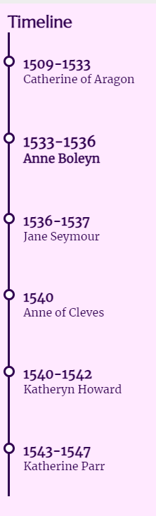

- Short introduction to site at top of homepage
    - Introduces user to the site so they know what to expect.
    - Fontawesone crowns are used either side to balance layout on larger screens, but these are removed on smaller screens to provide more space for the text and to prevent it becoming squashed.

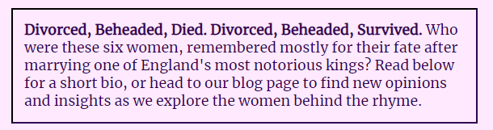

- Short biography of each wife on homepage with corresponding images
    - Provides brief overview without overwhelming the user with information right away.
    - Images are in black and white to match site colour scheme.
    - Image and bio text side-by-side on larger screens, with alternating order to visually break it up for the user.
    - Image above bio text on smaller screens, with horizontal rule between each one to visually break it up for the user.

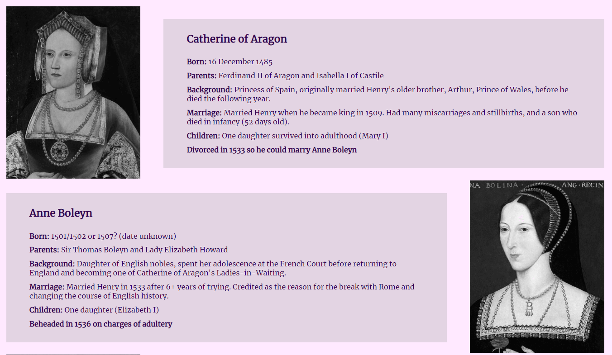
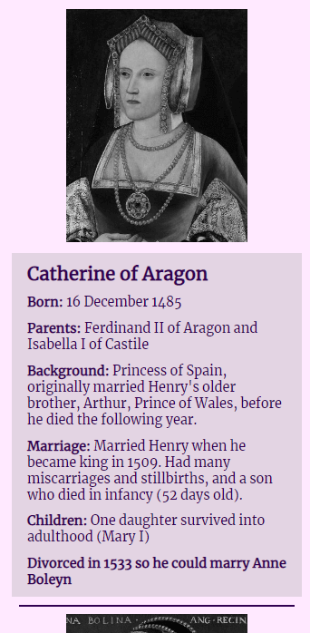

- About us section (footer)
    - Breifly explains the purpose of the site, as opposed to the introduction on the homepage which explains the site's content.
    - Positioned consistently at the bottom of each page as reminder to the user without overshadowing main page content.

- Subscribe section (footer)
    - Provides the user with the option to subscribe with an email address to be alerted to new site content.
    - Positioned consistently at the bottom of each page to provide multiple opportunities for the user to subscribe as they navigate site content.
    - NB: back-end functionality has yet to be developed.

- Blog posts
    - Site features blog posts featuring more in-depth opinions on specific topics related to Henry VIII's wives.
    - Users have the opportunity to send in their own works to the email address provided on the page.

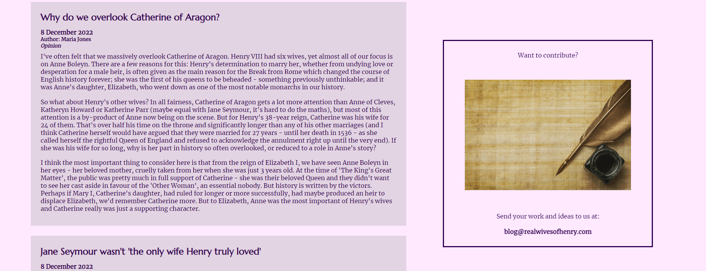

- More Resources
    - Site features a page with additional external resources should the user wish to find out more information, including Wikipedia articles and other site links, book recommendations and entertainment based on the subject matter. Sections are clearly divided to help the user find what they might be looking for.
    - All links open in a new tab so the user can easily come back to the website.

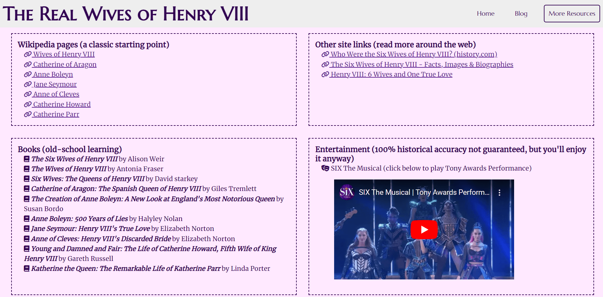

- Custom 404 error page
    - Users will see a custom 404 error page if they try to access non-existent pages on the site.
    - Page uses humour and a cartoon image to enhance user experience, and a link back to the homepage.

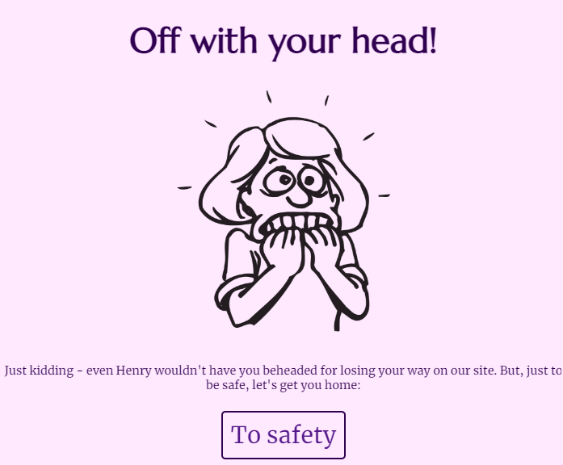

- Favicon
    - Site uses a custom favicon to enhance user experience. A crown emoji was selected to represent the queens and royalty.

- Colour scheme selection
    - Dark purple was chosen as the key colour as it used to be strongly associated with royalty.
    - Complementing shades of light purple and grey were chosen using [ColorSpace](mycolor.space).

### Features left to implement
- Back-end functionality for subscribe form (high priority).
- Make blog posts expandable/collapsable to take up less space on the screen (JavaScript). Consider creating a new page for each blog post to keep overall layout tidy.
- Add a search bar in the header so users can search for content as site content increases (see [Wireframes](#wireframes)).
- Add a comments section to blog posts so users can share and discuss their opinions.
- Create a social media presence to drive traffic and reach new users, and add links to the footer.

## Wireframes
[Balsamiq](https://balsamiq.com/) was used to create initial wireframes for the project. Two wireframes each were made for the homepage and the blog page, to account for changes across screen sizes, and one was made for the more resources page as the initial design did not require a change in layout (beyond header changes already shown on the other two pages). Layout changes from initial design to final website include:
- No inclusion of search bar (as mentioned above, this will be included as a feature in the future);
- 'About us' and 'Subscribe' sections are always at the bottom of the page, side-by-side on larger screens and one above the other on smaller screens (not centred);
- The timeline on the homepage remains at the side of the screen even on smaller screen sizes, rather than removing sticky positioning and only having it show at the top of the page. This allows for easier navigation of the bio sections and all content is resized accordingly;
- 'Contact' was removed from the navigation menu and no such page was created as it was deemed unnecessary - the option to subscribe is on each page and information to send in blog posts is on the blog page. If social media links were to be added, they would also be placed in the footer on each page. If the page is created in the future, it will be readded to the navigation menu, but there are no immediate plans for it;
- Blog posts are not collapsed as JavaScript is required to do this; and
- 'More Resources' uses a two-by-two grid layout on larger screens to make better use of space. The single-column layout is still used on smaller screens.

### Homepage

For larger screens (click to expand)

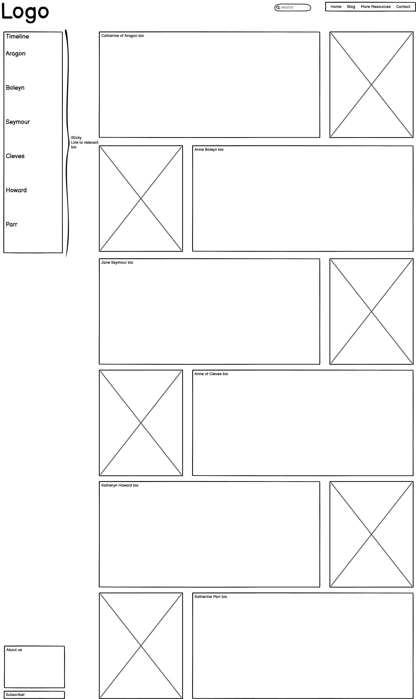

For smaller screens (click to expand)

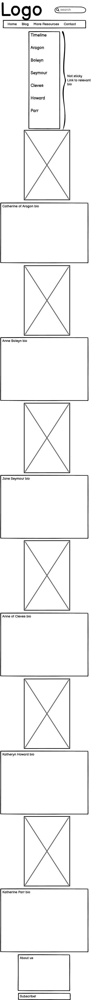

### Blog page

For larger screens (click to expand)

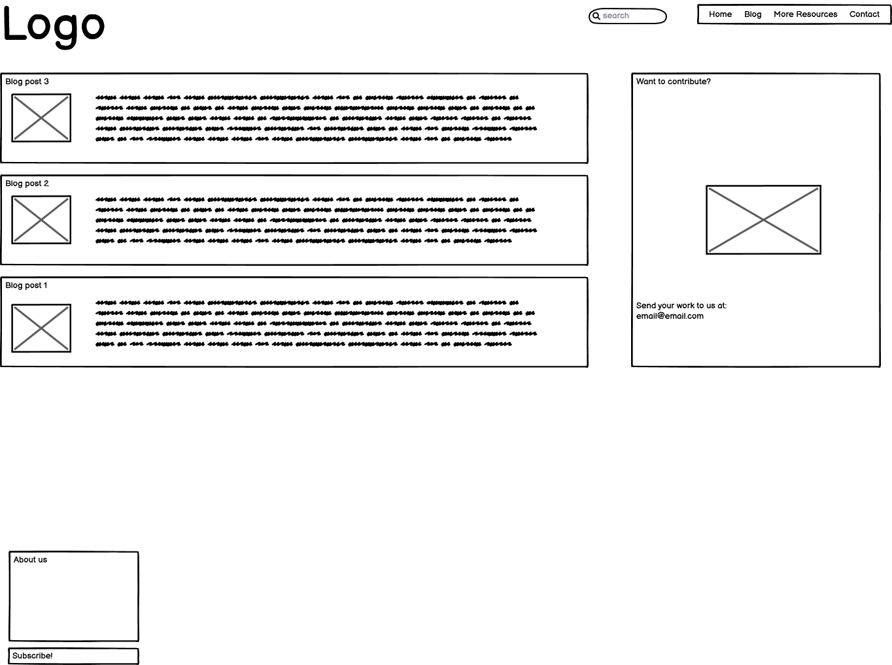

For smaller screens (click to expand)

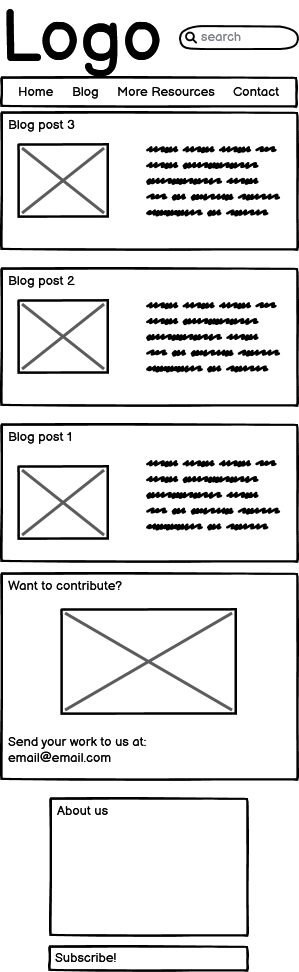

### More Resources page

For all screen sizes (click to expand)

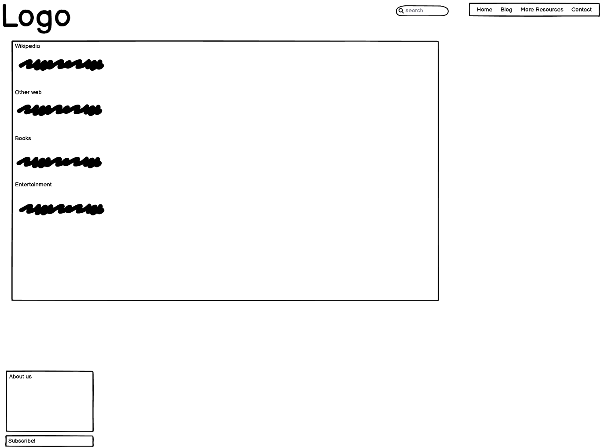

## Testing
### Issues found and fixed during development
- **Issue:** On homepage, when the user clicks on on of the timeline links, the page jumps to the correct section but the top is hidden by the fixed header. **Solved:** Added 'scroll-padding-top to the html element.
- **Issue:** On More Resources page, the content is not enough to fill larger screens and the footer doesn't sit at the bottom of the screen. Fixed positioning won't work as it should not be visible over body content and the user must scroll down to it on other pages. **Solved:** Set min-height and padding-bottom on the body element for all pages.
- **Issue:** Form submit doesn't work. **Solved:** Form element not used - added around existing form elements and retested; confirmed it is working. Also added 'required' to inputs.

### Final site tested in browsers
- Chrome: no issues
- Firefox: no issues
- Edge: no issues
- Safari: position: sticky doesn't work; position: -webkit-sticky added to timeline and contribute div to ensure functionality in Safari browsers.

### Final site tested on different devices and screen sizes
- Checked on large monitor, laptop screen and iPhone 11, as well as using Chrome dev tools (toggle device and responsive).
    - Footer overlaps main body content on some mobile phone devices turned to landscape. **Solved:** Changed padding-bottom unit on body from vh to px to have more control over.
    - Top of bio section is still hidden by the header when using timeline links. **Solved:** scroll-padding-top was changed to apply to html rather than *, but media queries still had it applying to *. Changed media queries to apply to html.
    - No other issues found.

### Validator testing
- HTML tested using [W3C validator](https://validator.w3.org/)
    - index.html no errors or warnings.
    - blog.html warning found: _Section lacks heading. Consider using h2-h6 elements to add identifying headings to all sections, or else use a div element instead for any cases where no heading is needed_ [line 55].
        - First paragraph element changed to h3 element and styled accordingly in CSS. No other errors or warnings returned.
    - more-resources.html error found: _The frameborder attribute on the iframe element is obsolete. Use CSS instead_ [line 94].
        - Frameborder attribute removed from element. No CSS changes needed as no border is required. No other errors or warnings returned.

- CSS tested using [(Jigsaw) validator](https://jigsaw.w3.org/css-validator/)
    - Error found on line 132: _, is an incorrect operator : 1fr,2fr,1fr_
        - Property removed from class as it's not required for the page layout.
    - No other errors returned.
    - Warning found on line 1:_'Imported style sheets are not checked in direct input and file upload modes_
        - External style sheet used for Google fonts not checked by external validator. Warning okay to ignore.
    - Warnings found on lines 98 and 272: _-webkit-sticky is a vendor extension_
        - Property used to allow sticky positioning in Safari browsers. Warning okay to ignore.
    - No other warnings returned.
    
### Colours/contrast checker
- Checked on [WebAIM](https://webaim.org/resources/contrastchecker/)
    - Contrast Ratio: 14.63:1 (pass)

### Dev tools - Lighthouse
- Homepage:
    - Performance: 100
    - Accessability: 100
    - Best Practices: 92
    - SEO: 100

- Blog:
    - Performance: 99
    - Accessability: 97
    - Best Practices: 92
    - SEO: 100

- More Resources:
    - Performance: 97
    - Accessability: 98
    - Best Practices: 83 > Issues come from external links and embedded video loading and cookies. All sites confirmed to load and open in a new tab, and video user controls confirmed to work.
    - SEO: 100

## Deployment
This site was deployed through GitHub pages using the following steps:
1. Open the GitHub repository and go to Settings
2. Go to Pages in the column on the left-hand side
3. Select Source: Deploy from a branch. From the drop-down menu underneath Branch, select main and save
4. Refresh the page after a few minutes and you will see that the site is live, with a link for you to access it

The live link can be found here: [https://mariacjones1.github.io/henry-viii-wives/](https://mariacjones1.github.io/henry-viii-wives/)

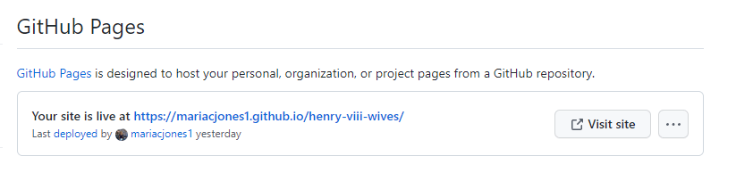

### Commit messages
Commit messages for this project were sometimes too small and only addressed part of a fix, especially as elements were tweaked and restyled or multiple things were done to the same element to achieve desired styling. Future commit messages should be optimised to be more concise.

## Credits
### Content
- All content (biographies and blogs) was written by me, with some research done using Wikipedia to confirm dates and names.
- Other websites were found using Google.
- Book recommendations were found on [goodreads](https://www.goodreads.com/shelf/show/tudor-nonfiction).
- The crown icons on the homepage and the link, book and theatre bullets on the More Resources page were taken from [Font Awesome](https://fontawesome.com/).
- Colours were chosen using [ColorSpace](https://mycolor.space/).
- Fonts were chosen using [Font Joy](https://fontjoy.com/) and found on [Google Fonts](https://fonts.google.com/).
- Form action link taken from Code Institute coding challenges.

### Media
- Portraits of Catherine of Aragon, Anne Boleyn, Jane Seymour, Anne of Cleves and Katherine Parr were found on [Wikipedia](https://en.wikipedia.org/wiki/Wives_of_Henry_VIII).
- Portrait of Katheryn Howard was found on [On The Tudor Trail](https://onthetudortrail.com/Blog/2019/05/14/the-portraiture-of-queen-katherine-howard-by-conor-byrne/).
- Image of parchment and quill was taken from [Shutterstock](https://www.shutterstock.com/image-photo/old-papyrus-paper-feather-quill-glass-176593856).
- Video of SIX The Musical Tony Awards performance was taken from [YouTube](https://www.youtube.com/watch?v=egqqtAo8WSI&ab_channel=SIX).
- Favicon was taken from [favicon.io](https://favicon.io/emoji-favicons/crown).

### Additional coding resources
- Flexbox: [CSS-Tricks](https://css-tricks.com/snippets/css/a-guide-to-flexbox/) and [Kevin Powell YouTube](https://www.youtube.com/watch?v=u044iM9xsWU&ab_channel=KevinPowell)
- CSS Grid: [CSS-Tricks](https://css-tricks.com/snippets/css/complete-guide-grid/) and [Kevin Powell YouTube](https://www.youtube.com/watch?v=rg7Fvvl3taU&t=1224s&ab_channel=KevinPowell)
- Getting the footer to stick at the bottom of the page, regardless of main content height: [Code Convey](https://codeconvey.com/footer-at-bottom-of-page-but-not-fixed/)
- Solution to prevent anchor links from being hidden behind fixed header: [Publii](https://getpublii.com/blog/one-line-css-solution-to-prevent-anchor-links-from-scrolling-behind-a-sticky-header.html)
- General help:
    - [w3 schools](https://www.w3schools.com/)
    - [MDN](https://developer.mozilla.org/en-US/)
    - [stack overflow](https://stackoverflow.com/)

### Mentor
Can Sucullu helped me plan and understand how to consider the purpose and relevance of the site and each feature when first approaching the project, and to keep this in mind as I continued to develop it. He also reviewed my work and offered advice to help me improve it, such as adding horizontal rules between the biographies when they appear as a single column on smaller screens.