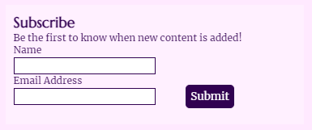

# The Real Wives of Henry VIII
The Real Wives of Henry VIII is a site aimed to educate users about each of Henry VIII's wives. It will be targeted toward people who want to know more biographical details about the women themselves, not just as a part of Henry's story, and will also offer a place to share and read opinion pieces on the subject. There will also be an option to subscribe, so users can be notified of new content. The site should be responsive so that it can be easily viewed on desktop, tablet and mobile devices.

## Features

### Existing features
- Responsive layouts
    - Desktop-, tablet- and mobile-friendly designs (see mock-up above).
- Header and site navigation menu
    - Featured consistently in the header on all three pages - Home, Blog and More Resources - allowing easy site navigation.
    - Logo in top left corner also navigates the user to the homepage.
    - Current page will always feature a border around the corresponding menu item so it's clear to the user which page they are on.
    - Header is fixed so user can always access navigation.

- Interactive timeline
    - Shows years each woman was married to Henry.
    - Also serves as internal page navigation - clicking on each one will jump to the bio of the respective wife. Text becomes larger and bold when user hovers over it with the mouse.
    - Timeline is sticky so user can continue to reference it or use it for navigation as they scroll down the page.

- Short introduction to site at top of homepage
    - Introduces user to the site so they know what to expect.
    - Fontawesone crowns are used either side to balance layout on larger screens, but these are removed on smaller screens to provide more space for the text and to prevent it becoming squashed.

- Short biography of each wife on homepage with corresponding images
    - Provides brief overview without overwhelming the user with information right away.
    - Images are in black and white to match site colour scheme.
    - Image and bio text side-by-side on larger screens, with alternating order to visually break it up for the user.
    - Image above bio text on smaller screens, with horizontal rule between each one to visually break it up for the user.

- About us section (footer)
    - Breifly explains the purpose of the site, as opposed to the introduction on the homepage which explains the site's content.
    - Positioned consistently at the bottom of each page as reminder to the user without overshadowing main page content.

- Subscribe section (footer)
    - Provides the user with the option to subscribe with an email address to be alerted to new site content.
    - Positioned consistently at the bottom of each page to provide multiple opportunities for the user to subscribe as they navigate site content.
    - NB: back-end functionality has yet to be developed.

- Blog posts
    - Site features blog posts featuring more in-depth opinions on specific topics related to Henry VIII's wives.
    - Users have the opportunity to send in their own works to the email address provided on the page.

- Colour scheme selection
    - Dark purple was chosen as the key colour as it used to be strongly associated with royalty.
    - Complementing shades of light purple and grey were chosen using [ColorSpace](mycolor.space).

### Features left to implement
- Back-end functionality for subscribe form (high priority).
- Make blog posts expandable/collapsable to take up less space on the screen (JavaScript). Consider creating a new page for each blog post to keep overall layout tidy.
- Add a search bar in the header so users can search for content as site content increases (see [Wireframes](#wireframes)).
- Add a comments section to blog posts so users can share and discuss their opinions.
- Create a social media presence to drive traffic and reach new users, and add links to the footer.

## Wireframes
[Balsamiq](https://balsamiq.com/) was used to create initial wireframes for the project. Two wireframes each were made for the homepage and the blog page, to account for changes across screen sizes, and one was made for the more resources page as the initial design did not require a change in layout (beyond header changes already shown on the other two pages). Layout changes from initial design to final website include:
- No inclusion of search bar (as mentioned above, this will be included as a feature in the future);
- 'About us' and 'Subscribe' sections are always at the bottom of the page, side-by-side on larger screens and one above the other on smaller screens (not centred);
- The timeline on the homepage remains at the side of the screen even on smaller screen sizes. This allows for easier navigation of the bio sections and all content is resized accordingly;
- 'Contact' was removed from the navigation menu and no such page was created as it was deemed unnecessary - the option to subscribe is on each page and information to send in blog posts is on the blog page. If social media links were to be added, they would also be placed in the footer on each page. If the page is created in the future, it will be readded to the navigation menu, but there are no immediate plans for it;
- Blog posts are not collapsed as JavaScript is required to do this; and
- 'More Resources' uses a two-by-two grid layout on larger screens to make better use of space. The single-column layout is still used on smaller screens.

### Homepage

### Blog page

### More Resources page

## Testing
### Issues found and fixed during development
- **Issue:** On homepage, when the user clicks on on of the timeline links, the page jumps to the correct section but the top is hidden by the fixed header. **Solution:** Add 'scroll-padding-top to the html element.
- **Issue:** On More Resources page, the content is not enough to fill larger screens and the footer doesn't sit at the bottom of the screen. Fixed positioning won't work as it should not be visible over body content and the user must scroll down to it on other pages. **Solution:** Set min-height and padding-bottom on the body element for all pages.

### Final site tested in browsers
- Chrome: no issues
- Firefox: no issues
- Edge: no issues
- Safari: position: sticky doesn't work; position: -webkit-sticky added to timeline and contribute div to ensure functionality in Safari browsers.

### Final site tested on different devices and screen sizes
- Checked on large monitor, laptop screen and iPhone 11, as well as using Chrome dev tools (toggle device and responsive).
    - Footer overlaps main body content on some mobile phone devices turned to landscape.

### Validator testing
- HTML tested using [W3C validator](https://validator.w3.org/)
    - index.html no errors or warnings.
    - blog.html warning found: _Section lacks heading. Consider using h2-h6 elements to add identifying headings to all sections, or else use a div element instead for any cases where no heading is needed_ [line 55].
        - First paragraph element changed to h3 element and styled accordingly in CSS. No other errors or warnings returned.
    - more-resources.html error found: _The frameborder attribute on the iframe element is obsolete. Use CSS instead_ [line 94].
        - Frameborder attribute removed from element. No CSS changes needed as no border is required. No other errors or warnings returned.

- CSS tested using [(Jigsaw) validator](https://jigsaw.w3.org/css-validator/)
    - Error found on line 132: _, is an incorrect operator : 1fr,2fr,1fr_
        - Property removed from class as it's not required for the page layout. No other errors returned.
    - Warning found on line 1:_'Imported style sheets are not checked in direct input and file upload modes_
        - External style sheet used for Google fonts not checked by external validator. Warning okay to ignore. No other warnings returned.